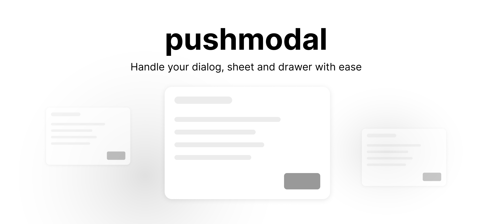

<br />
<br />

## Installation 

```bash
pnpm add pushmodal
```

> We take for granted that you already have `@radix-ui/react-dialog` installed. If not ➡️ `pnpm add @radix-ui/react-dialog`

## Usage

#### 1. Create a modal

When creating a dialog/sheet/drawer you need to wrap your component with the `<(Dialog|Sheet|Drawer)Content>` component. But skip the `Root` since we do that for you.

```tsx
// file: src/modals/modal-example.tsx
import { DialogContent } from '@/ui/dialog' // shadcn dialog

// or any of the below
// import { SheetContent } from '@/ui/sheet' // shadcn sheet
// import { DrawerContent } from '@/ui/drawer' // shadcn drawer

export default function ModalExample({ foo }: { foo: string }) {
  return (
    <DialogContent>
      Your modal
    </DialogContent>
  )
}
```


####  2. Initialize your modals

```tsx
// file: src/modals/index.tsx (alias '@/modals')
import ModalExample from './modal-example'
import SheetExample from './sheet-example'
import DrawerExample from './drawer-examle'
import { createPushModal } from 'pushmodal'
import { Drawer } from '@/ui/drawer' // shadcn drawer

export const {
  pushModal,
  popModal,
  popAllModals,
  replaceWithModal,
  useOnPushModal,
  onPushModal,
  ModalProvider
} = createPushModal({
  modals: {
    // Short hand
    ModalExample,
    SheetExample,

    // Longer definition where you can choose what wrapper you want
    // Only needed if you don't want `Dialog.Root` from '@radix-ui/react-dialog'
    // shadcn drawer needs a custom Wrapper
    DrawerExample: {
      Wrapper: Drawer,
      Component: DrawerExample
    }
  },
})
```

How we usually structure things

```md
src
├── ...
├── modals
│   ├── modal-example.tsx
│   ├── sheet-example.tsx
│   ├── drawer-examle.tsx
│   ├── ... more modals here ...
│   └── index.tsx
├── ...
└── ...
```

#### 3. Add the `<ModalProvider />` to your root file.

```ts
import { ModalProvider } from '@/modals' 

export default function App({ children }: { children: React.ReactNode }) {
  return (
    <>
      {/* Notice! You should not wrap your children */}
      <ModalProvider />
      {children}
    </>
  )
}
```

#### 4. Use `pushModal`

`pushModal` can have 1-2 arguments

1. `name` - name of your modal 
2. `props` (might be optional) - props for your modal, types are infered from your component!

```tsx
import { pushModal } from '@/modals' 

export default function RandomComponent() {
  return (
    <div>
      <button onClick={() =>  pushModal('ModalExample', { foo: 'string' })}>
        Open modal
      </button>
      <button onClick={() => pushModal('SheetExample')}>
        Open Sheet
      </button>
      <button onClick={() => pushModal('DrawerExample')}>
        Open Drawer
      </button>
    </div>
  )
}
```

#### 4. Closing modals

You can close a modal in three different ways:

- `popModal()` - will pop the last added modal
- `popModal('Modal1')` - will pop the last added modal with name `Modal1`
- `popAllModals()` - will close all your modals

#### 5. Replacing current modal

Replace the last pushed modal. Same interface as `pushModal`.

```ts
replaceWithModal('SheetExample', { /* Props if any */ })
```

#### 6. Using events

You can listen to events with `useOnPushModal` (inside react component) or `onPushModal` (or globally).

The event receive the state of the modal (open/closed), the modals name and props. You can listen to all modal changes with `*` or provide a name of the modal you want to listen on.

**Inside a component**

```tsx
import { useCallback } from 'react'
import { useOnPushModal } from '@/modals'

// file: a-react-component.tsx
export default function ReactComponent() {
  // listen to any modal open/close
  useOnPushModal('*', 
    useCallback((open, props, name) => {
      console.log('is open?', open);
      console.log('props from component', props);
      console.log('name', name);
    }, [])
  )
  
  // listen to `ModalExample` open/close
  useOnPushModal('ModalExample', 
    useCallback((open, props) => {
      console.log('is `ModalExample` open?', open);
      console.log('props for ModalExample', props);
    }, [])
  )
}
```

**Globally**

```ts
import { onPushModal } from '@/modals'

const unsub = onPushModal('*', (open, props, name) => {
  // do stuff
})
```

#### Responsive rendering (mobile/desktop)

In some cases you want to show a drawer on mobile and a dialog on desktop. This is possible and we have created a helper function to get you going faster. `createResponsiveWrapper` 💪 

```tsx
// path: src/modals/dynamic.tsx
import { createResponsiveWrapper } from 'pushmodal'
import { Dialog, DialogContent } from '@/ui/dialog'; // shadcn dialog
import { Drawer, DrawerContent } from '@/ui/drawer'; // shadcn drawer

export default createResponsiveWrapper({
  desktop: {
    Wrapper: Dialog,
    Content: DialogContent,
  },
  mobile: {
    Wrapper: Drawer,
    Content: DrawerContent,
  },
  breakpoint: 640,
});

// path: src/modals/your-modal.tsx
import * as Dynamic from './dynamic'

export default function YourModal() {
  return (
    <Dynamic.Content>
      Drawer in mobile and dialog on desktop 🤘
    </Dynamic.Content>
  )
}

// path: src/modals/index.ts
import * as Dynamic from './dynamic'
import YourModal from './your-modal'
import { createPushModal } from 'pushmodal'

export const {
  pushModal,
  popModal,
  popAllModals,
  replaceWithModal,
  useOnPushModal,
  onPushModal,
  ModalProvider
} = createPushModal({
  modals: {
    YourModal: {
      Wrapper: Dynamic.Wrapper,
      Component: YourModal
    }
  },
})
```

## Issues / Limitations

Issues or limitations will be listed here.

## Contributors

- [lindesvard](https://github.com/lindesvard)
- [nicholascostadev](https://github.com/nicholascostadev)